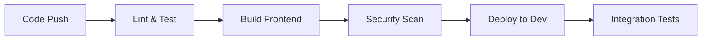
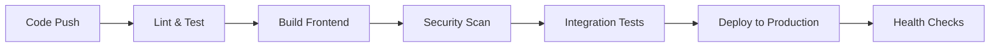
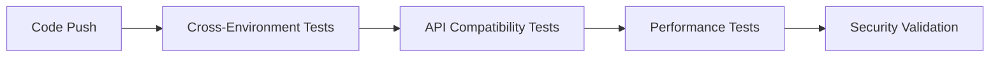

# CI/CD Setup for algo_webapp

## Overview

This document describes the complete CI/CD (Continuous Integration/Continuous Deployment) setup for the `algo_webapp` project, which supports both development and production environments with automated testing, building, and deployment pipelines.

## Architecture

### Directory Structure
```
algo_webapp/
├── config/
│   ├── shared/           # Common configuration for all environments
│   ├── development/      # Development-specific configuration
│   └── production/       # Production-specific configuration
├── .github/
│   └── workflows/        # GitHub Actions CI/CD workflows
├── deploy.sh             # Unified deployment script
├── deploy-development.sh # Development environment management
├── deploy-production.sh  # Production environment management
└── package.json          # NPM scripts for CI/CD operations
```

### Configuration Layers
1. **Shared Config**: Common settings used across all environments
2. **Development Config**: Local development, testing, and mock services
3. **Production Config**: Production deployment with external backend integration

## Branching Strategy

### Git Flow Implementation
- **`main`**: Production-ready code (protected)
- **`development`**: Active development and testing
- **`production`**: Production releases and hotfixes

### Branch Protection Rules
- **`main`**: Requires PR review, CI/CD passing
- **`development`**: Requires CI/CD passing
- **`production`**: Requires PR review, CI/CD passing

## CI/CD Pipeline Stages

### 1. Development Pipeline (`development` branch)


**Triggers**: Push to `development` branch
**Environment**: Development with mock backend
**Services**: Frontend, Mock Backend, Development Monitoring

### 2. Production Pipeline (`production` branch)


**Triggers**: Push to `production` branch
**Environment**: Production with external backend
**Services**: Frontend, Nginx Proxy, Production Monitoring

### 3. Integration Pipeline (All branches)


**Triggers**: Push to any branch
**Purpose**: Ensure compatibility across environments

## Configuration Management

### Environment Variables
- **Development**: `config/development/env.development`
- **Production**: `config/production/env.production`
- **Shared**: `config/shared/*.config.js`

### Docker Compose Files
- **Development**: `config/development/docker-compose.development.yml`
- **Production**: `config/production/docker-compose.production.yml`

### Nginx Configuration
- **Development**: Basic proxy for mock backend
- **Production**: Full reverse proxy with SSL, rate limiting, security headers

## Available Commands

### Development Environment
```bash
# Start development environment
npm run deploy:dev

# Start with mock backend
npm run deploy:dev:mock

# Start with monitoring
npm run deploy:dev:monitoring

# Check status
npm run deploy:dev:status

# View logs
npm run deploy:dev:logs

# Stop services
npm run deploy:dev:stop

# Restart services
npm run deploy:dev:restart

# Health check
npm run deploy:dev:health

# Cleanup
npm run deploy:dev:cleanup
```

### Production Environment
```bash
# Deploy to production
npm run deploy:production

# Check status
npm run deploy:production:status

# View logs
npm run deploy:production:logs

# Stop services
npm run deploy:production:stop

# Restart services
npm run deploy:production:restart

# Health check
npm run deploy:production:health
```

### Unified Commands
```bash
# Development (via deploy.sh)
npm run deploy:dev:start
npm run deploy:dev:status
npm run deploy:dev:logs
npm run deploy:dev:stop

# Production (via deploy.sh)
npm run deploy:prod:deploy
npm run deploy:prod:status
npm run deploy:prod:logs
npm run deploy:prod:stop
```

## GitHub Actions Workflow

### Workflow File: `.github/workflows/ci-cd.yml`

#### Development Job
- **Trigger**: Push to `development` branch
- **Steps**:
  1. Checkout code
  2. Setup Node.js
  3. Install dependencies
  4. Lint code (ESLint)
  5. Run tests
  6. Build frontend
  7. Security scan (Trivy)
  8. Deploy to development environment

#### Production Job
- **Trigger**: Push to `production` branch
- **Steps**:
  1. Checkout code
  2. Setup Node.js
  3. Install dependencies
  4. Lint code (ESLint)
  5. Run tests
  6. Build frontend
  7. Security scan (Trivy)
  8. Integration tests
  9. Deploy to production environment

#### Integration Job
- **Trigger**: Push to any branch
- **Steps**:
  1. Cross-environment compatibility tests
  2. API integration tests
  3. Performance benchmarks
  4. Security validation

#### Manual Deployment
- **Trigger**: Manual workflow dispatch
- **Purpose**: Emergency deployments or testing

## Security Features

### Vulnerability Scanning
- **Docker Images**: Trivy for container vulnerabilities
- **Dependencies**: npm audit for package vulnerabilities
- **Code Quality**: ESLint for code standards

### Security Headers
- **Nginx**: Security headers, rate limiting, CORS
- **Frontend**: CSP, HSTS, XSS protection
- **API**: Authentication, authorization, input validation

## Monitoring and Observability

### Development Monitoring
- **Prometheus**: Metrics collection
- **Grafana**: Visualization and dashboards
- **Health Checks**: Service availability monitoring

### Production Monitoring
- **Prometheus**: Production metrics
- **Grafana**: Production dashboards
- **Nginx**: Access logs, error logs, performance metrics
- **Health Checks**: Automated service monitoring

## Network Configuration

### Docker Networks
- **Development**: `algo-trading-app-dev`
- **Production**: `backend_trading-network` (external)
- **Shared Services**: Cross-network communication

### Service Discovery
- **Development**: Local Docker network
- **Production**: External backend network integration
- **API Routing**: Dynamic endpoint resolution

## Environment-Specific Features

### Development Environment
- **Hot Reloading**: Fast refresh, file watching
- **Mock Backend**: Simulated API responses
- **Debug Tools**: Source maps, development logging
- **Local Testing**: Isolated development environment

### Production Environment
- **Optimized Builds**: Minified, compressed assets
- **External Integration**: Backend service integration
- **SSL/TLS**: Secure HTTPS connections
- **Load Balancing**: Nginx reverse proxy
- **Rate Limiting**: API protection
- **Security Headers**: Enhanced security

## Troubleshooting

### Common Issues

#### Development Environment
```bash
# Port conflicts
npm run deploy:dev:stop
docker system prune -f
npm run deploy:dev

# Mock backend not responding
npm run deploy:dev:mock
docker logs algo-trading-app-dev-mock-backend-1
```

#### Production Environment
```bash
# Backend connection issues
npm run deploy:production:health
docker logs algo-trading-app-prod-frontend-1

# Nginx configuration
docker exec -it algo-trading-app-prod-nginx-proxy-1 nginx -t
```

#### General Issues
```bash
# Check all services
docker ps -a
docker network ls

# View logs
npm run deploy:dev:logs
npm run deploy:production:logs

# Health checks
npm run deploy:dev:health
npm run deploy:production:health
```

### Debug Commands
```bash
# Check environment
echo $NODE_ENV
cat config/development/env.development

# Verify Docker setup
docker-compose -f config/development/docker-compose.development.yml config

# Check network connectivity
docker network inspect algo-trading-app-dev
```

## Best Practices

### Development Workflow
1. **Branch**: Create feature branch from `development`
2. **Develop**: Make changes and test locally
3. **Test**: Use development environment for testing
4. **Commit**: Push to feature branch
5. **Merge**: Create PR to `development`
6. **Deploy**: CI/CD automatically deploys to development

### Production Workflow
1. **Prepare**: Ensure `development` is stable
2. **Merge**: Create PR from `development` to `production`
3. **Review**: Code review and approval
4. **Deploy**: CI/CD automatically deploys to production
5. **Monitor**: Watch production health and metrics
6. **Rollback**: Use deployment scripts if needed

### Configuration Management
1. **Shared**: Keep common settings in `config/shared/`
2. **Environment**: Use specific configs for each environment
3. **Secrets**: Store sensitive data in environment files
4. **Versioning**: Commit configuration changes with code

## Performance Optimization

### Development
- **Fast Refresh**: Enable React Fast Refresh
- **Source Maps**: Include for debugging
- **Hot Reloading**: File watching and auto-reload

### Production
- **Code Splitting**: Dynamic imports and lazy loading
- **Tree Shaking**: Remove unused code
- **Asset Optimization**: Minification and compression
- **Caching**: Browser and CDN caching strategies

## Scaling Considerations

### Horizontal Scaling
- **Load Balancer**: Nginx upstream configuration
- **Multiple Instances**: Docker service scaling
- **Health Checks**: Automatic instance management

### Vertical Scaling
- **Resource Limits**: Docker memory and CPU limits
- **Performance Tuning**: Node.js and Nginx optimization
- **Monitoring**: Resource usage tracking

## Backup and Recovery

### Configuration Backup
```bash
# Backup configuration
tar -czf config-backup-$(date +%Y%m%d).tar.gz config/

# Restore configuration
tar -xzf config-backup-YYYYMMDD.tar.gz
```

### Data Backup
- **Volumes**: Docker volume backups
- **Environment**: Configuration file backups
- **Scripts**: Deployment script backups

## Future Enhancements

### Planned Features
- **Multi-region Deployment**: Geographic distribution
- **Blue-Green Deployment**: Zero-downtime deployments
- **Canary Releases**: Gradual rollout strategy
- **Automated Rollback**: Failure detection and recovery

### Integration Opportunities
- **Slack Notifications**: Deployment status updates
- **JIRA Integration**: Issue tracking and deployment linking
- **Metrics Dashboard**: Real-time performance monitoring
- **Alerting**: Automated issue detection and notification

## Support and Maintenance

### Regular Tasks
- **Security Updates**: Dependency and image updates
- **Performance Monitoring**: Metrics and alerting
- **Backup Verification**: Configuration and data backups
- **Documentation Updates**: Process and configuration updates

### Emergency Procedures
- **Service Outage**: Health check failures
- **Security Incident**: Vulnerability detection
- **Performance Issues**: Response time degradation
- **Data Loss**: Configuration or data corruption

---

## Quick Reference

### Essential Commands
```bash
# Development
npm run deploy:dev

# Production
npm run deploy:production

# Status Check
npm run deploy:dev:status
npm run deploy:production:status

# Health Check
npm run deploy:dev:health
npm run deploy:production:health
```

### Configuration Files
- **Development**: `config/development/`
- **Production**: `config/production/`
- **Shared**: `config/shared/`
- **Workflows**: `.github/workflows/`

### Network Ports
- **Development Frontend**: 3000
- **Production Frontend**: 3000
- **Mock Backend**: 3003
- **External Backend**: 3003
- **Monitoring**: 9090 (Prometheus), 3001 (Grafana)

This CI/CD setup provides a robust, scalable, and maintainable deployment pipeline for both development and production environments, ensuring code quality, security, and operational excellence.
